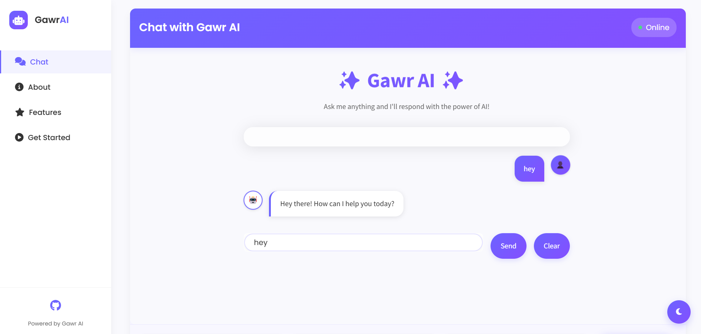
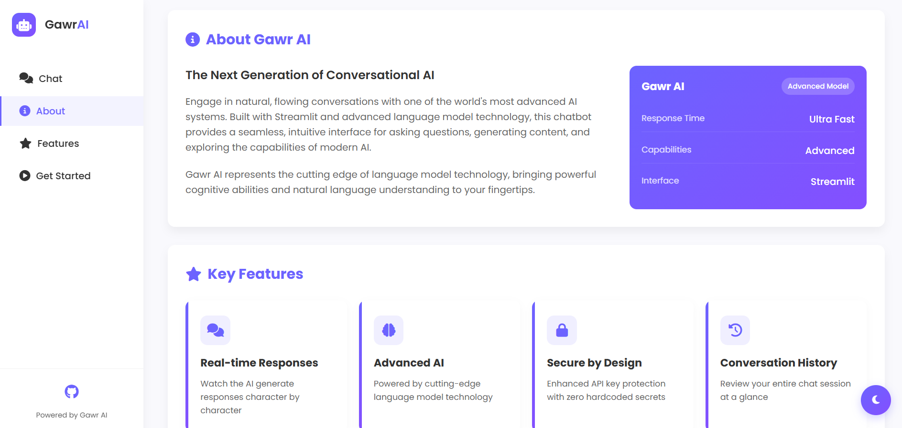
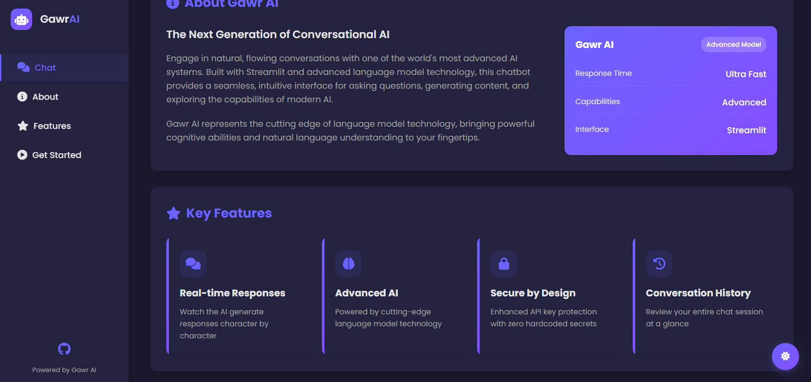
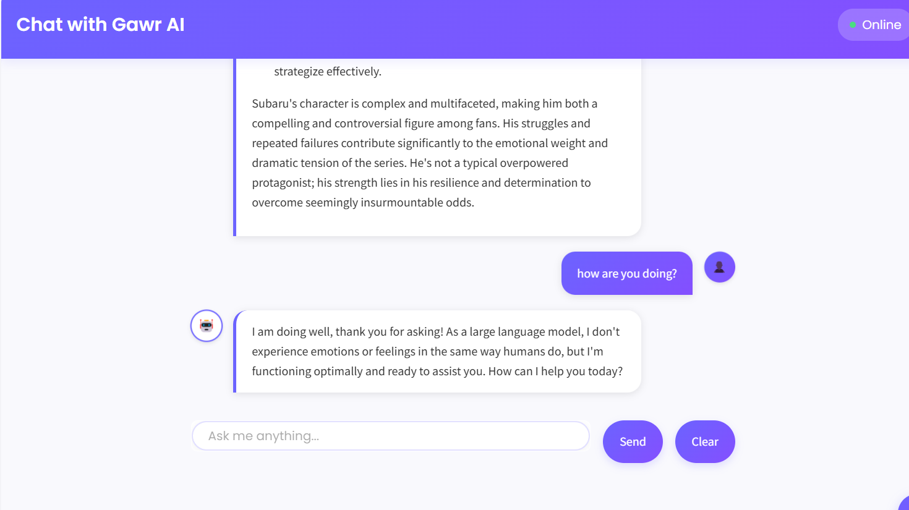

# 🤖 Gawr AI Chat Assistant

<p align="center">
  
  
  
  
  
</p>

<p align="center">
  <a href="#-overview">Overview</a> •
  <a href="#-project-preview">Preview</a> •
  <a href="#-features">Features</a> •
  <a href="#-installation">Installation</a> •
  <a href="#-usage">Usage</a> •
  <a href="#-web-interface">Web Interface</a> •
  <a href="#-security">Security</a> •
  <a href="#-requirements">Requirements</a>
</p>

```
┌─────────────────────── Gawr AI Interface ───────────────────────┐
│                                                                 │
│  User: Tell me about language models                            │
│                                                                 │
│  Gawr AI: Language models are AI systems trained on vast        │
│  amounts of text to understand and generate human language.     │
│  They can answer questions, write content, translate            │
│  languages, and more by predicting what words should come       │
│  next in a sequence.                                            │
│                                                                 │
└─────────────────────────────────────────────────────────────────┘
```

<p align="center"><em>Experience fluid, natural conversations with Gawr AI's advanced language model through a beautiful web interface with animated chat bubbles.</em></p>

---

## ✨ Overview

The Gawr AI Chat Assistant provides a sleek, intuitive interface for interacting with cutting-edge large language model technology. This application bridges the gap between advanced AI technology and everyday users through a beautiful, responsive design inspired by modern AI interfaces.

The application features a modern dark theme with purple accents (#6c63ff), smooth animations, and an intuitive chat interface that makes AI interaction feel natural and engaging.

## 📷 Project Preview

<div align="center">
  <h3>Main Chat Interface</h3>
  
  
  <h3>Dark Theme UI</h3>
  
  
  <h3>Features Section</h3>
  
  
  <h3>Getting Started Guide</h3>
  
</div>

## 🚀 Features

<table>
  <tr>
    <td align="center"><h3>💬</h3></td>
    <td><b>Conversational Interface</b><br>Natural dialogue with Google's Gemini 1.5 Flash model</td>
    <td align="center"><h3>🎨</h3></td>
    <td><b>Beautiful UI</b><br>Modern, eye-friendly design with smooth animations</td>
  </tr>
  <tr>
    <td align="center"><h3>🧠</h3></td>
    <td><b>Advanced AI Model</b><br>Powered by latest language model technology</td>
    <td align="center"><h3>📱</h3></td>
    <td><b>Responsive Design</b><br>Works beautifully on desktops, tablets and mobile devices</td>
  </tr>
  <tr>
    <td align="center"><h3>🔒</h3></td>
    <td><b>Secure API Handling</b><br>Environment variables for sensitive credentials</td>
    <td align="center"><h3>📜</h3></td>
    <td><b>Conversation Memory</b><br>Chat history preserved throughout your session</td>
  </tr>
  <tr>
    <td align="center"><h3>🌐</h3></td>
    <td><b>Pure Web Integration</b><br>Direct Flask API integration with modern frontend</td>
    <td align="center"><h3>⚡</h3></td>
    <td><b>Easy Deployment</b><br>Simple setup with minimal dependencies</td>
  </tr>
  <tr>
    <td align="center"><h3>🔐</h3></td>
    <td><b>SSL/TLS Support</b><br>Automatic HTTPS when certificates are available</td>
    <td align="center"><h3>🔄</h3></td>
    <td><b>Model Fallback</b><br>Automatic fallback from Gemini 1.5 Flash to 1.0 Pro</td>
  </tr>
  <tr>
    <td align="center"><h3>🔊</h3></td>
    <td><b>Voice Input Support</b><br>Cross-browser microphone handling with permissions fix</td>
    <td align="center"><h3>📋</h3></td>
    <td><b>Detailed Logging</b><br>Comprehensive error reporting for troubleshooting</td>
  </tr>
</table>

## 📥 Installation

```bash
# Clone this repository
git clone https://github.com/yourusername/gawr-ai-assistant.git
cd gawr-ai-assistant

# Create and activate virtual environment (optional but recommended)
python -m venv venv
source venv/bin/activate  # On Windows: venv\Scripts\activate

# Install required packages
pip install -r requirements.txt

# Set up your Google API key in a .env file
echo "GOOGLE_API_KEY=your_api_key_here" > .env

# Launch the application
python server.py
# OR use the provided batch file on Windows
start.bat
```

## 🛠 Usage

1. **Start the Flask server**:
   ```bash
   python server.py
   ```
   or simply run `start.bat` on Windows

2. **Access the web interface**:
   - The web interface will be available at http://localhost:8000
   - If SSL certificates (cert.pem and key.pem) are detected, HTTPS will be automatically enabled
   - The server handles both the frontend and the API requests

3. **Chat with Gawr AI**:
   - Type your questions or prompts in the input field
   - Click "Send" or press Enter to receive AI-generated responses
   - Use "Clear Chat" to start a new conversation
   - Use the microphone button for voice input (permission handling included)

## 🌐 Web Interface

The project features a complete web application with a Flask backend:

### Components

- **HTML/CSS/JS Frontend**: Beautiful, responsive interface with navigation
- **Flask Backend**: Fast API server for handling requests to Google's Generative AI
- **Integrated Static Files**: All resources are served by the Flask server

### Features

- **Navigation**: Easily switch between Chat, About, Features, and Get Started sections
- **Theme Toggle**: Switch between light and dark themes with a floating button
- **Real-time Chat**: Direct communication with the AI without page refreshes
- **Responsive Design**: Adapts to all screen sizes with sidebar collapsing on mobile
- **Beautiful Animations**: Smooth transitions and loading animations throughout
- **Voice Input**: Enhanced microphone support with cross-browser compatibility
- **Cache Management**: Proper cache control headers for reliable updates

## 🔐 Security

This application prioritizes security in handling API credentials:

- **No Hardcoded Keys**: API keys are never stored in the codebase
- **Environment Variables**: Credentials are stored in a `.env` file (not committed to version control)
- **Clear Instructions**: Helpful error messages guide users when API keys are missing
- **SSL/TLS Support**: Automatic HTTPS when certificates are available
- **Safe Error Handling**: Secure API error processing without exposing sensitive information

## 💻 Requirements

- Python 3.8+
- Flask 2.3.3+
- Google Generative AI library
- Python-dotenv
- Modern web browser (Chrome, Firefox, Edge recommended)

See `requirements.txt` for the complete list of dependencies.

## 🎨 Interface Design

The interface features:

- **Purple Color Scheme**: Beautiful purple theme (#6c63ff) with gradients
- **Animated Message Bubbles**: Chat messages appear with smooth animations
- **Responsive Layout**: Adapts to different screen sizes
- **Typing Indicators**: Visual feedback when AI is generating responses
- **Modern UI Elements**: Chat bubbles, cards, and intuitive navigation
- **Visual Feedback**: Subtle animations and transitions enhance the experience

## 🛠️ Project Structure

- `server.py` - Flask server that handles API requests and serves static files
- `index.html` - Main webpage with the chat interface
- `styles.css` - Styling for the web interface
- `critical-styles.css` - Core styles for faster initial page rendering
- `script.js` - JavaScript for the web interface functionality
- `mic-fix.js` - Handles microphone permissions across browsers
- `refresh.html` - Page to clear browser caches and force reload
- `requirements.txt` - Python dependencies
- `start.bat` - Windows batch file for easy startup

## 🔧 Customization

### Changing the Color Scheme

The primary color (#6c63ff) can be modified in:
- `styles.css` - For the web interface elements

### Modifying the AI Model

You can change the Gemini model in `server.py` by updating:
```python
model = genai.GenerativeModel(model_name="gemini-1.5-flash")
```

## 🚨 Troubleshooting

### Common Issues:

1. **API Key Not Working**:
   - Ensure your API key has access to Gemini models
   - Check for typos in your .env file
   - Verify quota and billing status in Google AI Studio

2. **Server Connection Issues**:
   - If getting TLS/SSL errors, navigate to /refresh.html to clear browser cache
   - Check if port 8000 is available on your system

3. **Browser Compatibility**:
   - If microphone doesn't work, ensure your browser has permission to access it
   - Try refreshing the page or using a different browser if issues persist

## 📄 License

This project is licensed under the MIT License - see the LICENSE file for details.

---

<div align="center">

<p>Created with ❤️ by Sourya Sarkar</p>

<p>
  ⭐ <b>Star this repository if you found it useful!</b> ⭐
</p>

</div> 